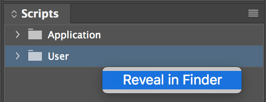
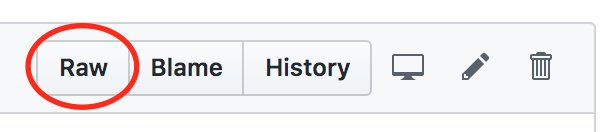
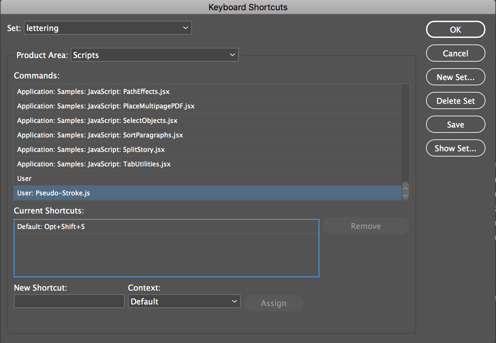
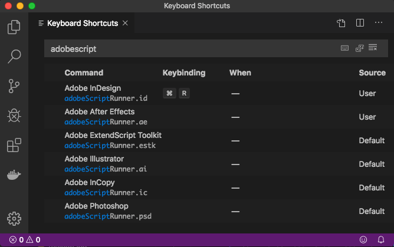
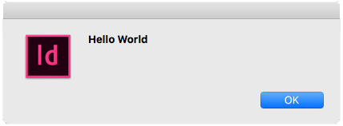

**Contents**
- [How to use scripts in InDesign](#how-to-use-scripts-in-indesign)
- [How to write scripts in InDesign](#how-to-write-scripts-in-indesign)
- [Frequently Asked Questions](#faq)
- [Script De-script-ions](#script-descriptions)

# How to use scripts in InDesign

> This guide will be using Adobe CC 2019 on Mac OS X, but the overall process should be similar on different versions and operating systems.

## The Fast and Simple Way
1) To locate your Scripts folder, open InDesign. Open the Scripts panel (Window > Utilities > Scripts). Right-click on the **User** folder, and select **Reveal in Finder**. This is where you can save any JavaScript files you want to run in InDesign.



2) Navigate to a specific GitHub script you'd like to download, like [this one](https://github.com/saraoswald/Manga-Scripts/blob/master/Pseudo-Stroke.js). Right-click on "Raw" in the upper right-hand corner of the page, and **Save Link As...**

 

3) Save the JavaScript file in the folder you found in Step 1. When you go back to the Scripts panel in InDesign, you should now see the file.
4) You can run the file either by:
    - Right-click and **Run Script**
    - Double-clicking on the script
    - Assigning the script to a keyboard shortcut (see **Setting up Keyboard Shortcuts** below)

## Setting up Keyboard Shortcuts
Once you have a file available in the Scripts panel, you can assign it to any available keyboard shortcut for easy access. 
1) In InDesign, open **Edit > Keyboard Shortcuts...**
2) Select the **Product Area** as **Scripts**
3) Select whichever script you'd like to assign a shortcut. In the **New Shortcut** field, press your desired keystroke, and then click **Assign** to save it. Finally, click **OK**. 

 

# How to write scripts in InDesign
## Setup
1) Install [Visual Studio Code](https://code.visualstudio.com/)
2) In VS Code, install the [Adobe Script Runner Extension](https://marketplace.visualstudio.com/items?itemName=renderTom.adobe-script-runner#installation)
3) Open Keyboard Shortcuts (On Windows, `File > Preferences > Keyboard Shortcuts` / On Mac, `Code > Preferences > Keyboard Shortcuts`)
4) In the search bar, type "adobescriptrunner"
 
5) Reset the keybinding for `Command/Control + R` to be InDesign. [Refer to this guide for help with binding keyboard shortcuts.](https://code.visualstudio.com/docs/getstarted/keybindings#_keyboard-shortcuts-editor)

## Run a Sample Script
1) Make sure that InDesign is open.
2) In VS Code, open a new text file (`Command/Control + N`), and copy and paste the script below into it:
> alert("Hello World")
3) Press `Command/Control + R` (the shortcut from the setup section above), and you should get this popup in InDesign: 

 

**(optional)** You can also set up the [ExtendScript Debugger extension](https://marketplace.visualstudio.com/items?itemName=Adobe.extendscript-debug) for a true debugging experience, though I've had mixed results attaching it to the InDesign process. 

## Sample Scripts
To help you get started, here are a couple sample scripts. 

**Keep in mind that ExtendScript is based off of a very outdated version of Javascript, so it does not support most modern functions.** Here are some examples of features that are not supported: 
- [Array.indexOf](https://developer.mozilla.org/en-US/docs/Web/JavaScript/Reference/Global_Objects/Array/indexOf)
- [String.trim](https://developer.mozilla.org/en-US/docs/Web/JavaScript/Reference/Global_Objects/String/trim)
- [Array.map](https://developer.mozilla.org/en-US/docs/Web/JavaScript/Reference/Global_Objects/Array/map)
- [Arrow functions](https://developer.mozilla.org/en-US/docs/Web/JavaScript/Reference/Functions/Arrow_functions)
- [Template literals](https://developer.mozilla.org/en-US/docs/Web/JavaScript/Reference/Template_literals)

**Display info about the current active page:**

    var activePage = app.activeWindow.activePage;
    alert('Page ' + activePage.name + '\n'
        + 'Text Frames: ' + activePage.textFrames.length + '\n'
        + 'Graphics: ' + activePage.allGraphics.length + '\n'
        + 'Side: ' + activePage.side.toString() + '\n' 
        + 'Bounds: ' + activePage.bounds);

**Display the contents of all the selected text frames, without line breaks**:

    var selections = app.selection,
        output = "";
    for(var i = 0; i < selections.length; i++){
        if(selections[i] instanceof TextFrame && !!selections[i].contents){
            output += selections[i].contents.replace(/[^\S ]+/g,'') + '\n';
        }
    }
    alert(output);


## Resouces
- [Latest ExtendScript API](https://www.indesignjs.de/extendscriptAPI/indesign-latest/)
- [CS6 Object Model / Class Index](http://jongware.mit.edu/idcs6js/inxx.html)
- [Script UI Guide for Dialogs and Stuff (PDF)](https://adobeindd.com/view/publications/a0207571-ff5b-4bbf-a540-07079bd21d75/92ra/publication-web-resources/pdf/scriptui-2-16-j.pdf)


# FAQ
## Do your scripts only work in CC? 
I only have access to Adobe CC, so that's the only place I'm able to test them. I have no idea if they'll work on your computer, but I try my best not to use features I know aren't supported before CC. 

## I updated InDesign, and now this script doesn't work. Can you fix it? 
Creative Cloud will try to migrate scripts over between versions automatically, but it can mess scripts up. Please [re-install](#how-to-use-scripts-in-indesign) affected scripts before [reaching out with some info to help me debug](#why-didnt-this-script-work).

## Why didn't this script work? 
**Before reaching out to me, please make sure you have correctly installed the script, and that you've read the instructions at the top of the script file.**

I'm only able to test scripts on my own files and workflow, so there are bound to be discrepancies. 

I'm happy to help you figure out what's wrong, but I need the following from you: 
1) What steps make this issue happen?
2) Was there an error message that popped up? What did it say?
3) What version of InDesign are you using? 
4) What operating system are you using (Mac/Windows)?
5) (Optional) A sample file that you can reproduce the issue in reliably

## I updated to a new version of ID, and now your scripts won't work!
Sometimes InDesign's migration tool messes up Javascript files. I recommend either: 
- Downloading the scripts again
- Manually copying and pasting your old Scripts Panel folder into the new Scripts Panel folder
    - See [Step 1 of the Installation Guide](#the-fast-and-simple-way) for help finding the Scripts Panel folder

If neither of those fix the issue, see [Why didn't this script work?](#why-didnt-this-script-work).

## What tools do you use?
- Adobe CC 2020
- [Visual Studio Code](https://code.visualstudio.com/)
- [VS Code Adobe Script Runner Extension](https://marketplace.visualstudio.com/items?itemName=renderTom.adobe-script-runner)
- [VS Code ExtendScript Debugger](https://marketplace.visualstudio.com/items?itemName=Adobe.extendscript-debug)

I do not recommend using the ExtendScript Toolkit application from Adobe. It's no longer supported in CC, and it's a very clunky experience. 

## Can I use your scripts to write my own? 
Yes, you can use parts of these scripts in your own so long as you: 
1) Do not sell them
2) Credit me

## Can you write an InDesign script for me?
Sure! Feel free to shoot me a DM on [Twitter](https://twitter.com/salinsley). 


---

# Script Descriptions

## Text Balancing and Design
### Add Break to
A common operation when balancing text is to add a line break to the top or bottom. There are 4 scripts that you can assign to keyboard shortcuts to do this quickly:
- [Add Break to Bottom.js](/Add%20Break%20to%20Bottom.js)
- [Add Break to Top.js](/Add%20Break%20to%20Top.js)
- [Add Break to Second to Bottom.js](/Add%20Break%20to%20Second%20to%20Bottom.js)
- [Add Break to Second to Top.js](/Add%20Break%20to%20Second%20to%20Top.js)

Videos showing these scripts in action can be found [here](https://twitter.com/salinsley/status/1230866286026149889) and [here](https://twitter.com/salinsley/status/1301140858117464065).

Full guide on how to use these scripts to balance text can be found [here](https://github.com/saraoswald/lettering-tutorials/wiki/Text-Placement-and-Balancing#balancing-with-scripts). 

### Adjust Size and Leading
If for whatever reason you can't use [InDesign's auto-leading](https://github.com/saraoswald/lettering-tutorials/wiki/Text-Placement-and-Balancing#sizing-the-fast-way), these scripts will allow you to adjust both the selected text's size and leading at the same time by the same point amount. 
- [Adjust Size and Leading - Decrease.js](/Adjust%20Size%20and%20Leading%20-%20Decrease.js)
- [Adjust Size and Leading - Increase.js](/Adjust%20Size%20and%20Leading%20-%20Increase.js)

Set these two scripts to keyboard shortcuts for easy usage. 

*NOTE*: the amount that the script increases/descreases is determined by the leading setting for the active document. Change this setting in `Preferences > Units & Increments > Keyboard Increments > Size/Leading`

### Manga Em Dash
[Manga Em Dash.js](/Manga%20Em%20Dash.js) replaces all em dash glyphs with a 200% wide hyphen. This is useful when a font's em dash glyph is the traditional double-dash style, and you're asked to replace them with long hyphens instead.

Creates a new character style with the name "200% Width".

Video showing this script in action can be found [here](https://twitter.com/salinsley/status/1318248888499920897).

### Manual Kerning
[Manual Kerning.js](Manual%20Kerning.js) is useful when using a font that is designed with poor kerning. You set predefined values in the kerningPairs variable, and the script applies those values when you run it on a text frame. 

Video showing this script in action can be found [here](https://twitter.com/salinsley/status/1259537310938476544).

### Pseudo Stroke
[Pseudo-Stroke.js](Pseudo-Stroke.js) helps with strokes in InDesign. It is basically the equivalent of doing this: 
- creating a duplicate text frame and 
    - converting its text to outlines
    - adding a stroke to its text
    - moving it behind the original text frame 
- putting the duplicate and original text frame in a group

Video showing this script in action can be found [here](https://twitter.com/salinsley/status/1279054362472583168).

### Remove Breaks
[Remove Breaks.js](Remove%20Breaks.js) works in conjunction with the [Add Break to](#add-break-to) scripts. Removes all the carriage returns in a text frame, for when you want to re-balance a text frame. 

Video showing this script in action can be found [here](https://twitter.com/salinsley/status/1254782259414003712)

### Skew Frame
[Skew Frame.js](Skew%20Frame.js) increments the Rotation and Shear X Angle of a text frame by the same amount.

Video showing this script in action can be found [here](https://twitter.com/salinsley/status/1246145258586550272)

### Squeeze Frame
A common operation when balancing text is to adjust the height or width of a text frame by a small amount. There are 4 scripts that you can assign to keyboard shortcuts to do this quickly:
- [Squeeze Frame - Horizontal - In.js](/Squeeze%20Frame%20-%20Horizontal%20-%20In.js)
- [Squeeze Frame - Horizontal - Out.js](/Squeeze%20Frame%20-%20Horizontal%20-%20Out.js)
- [Squeeze Frame - Vertical - In.js](/Squeeze%20Frame%20-%20Vertical%20-%20In.js)
- [Squeeze Frame - Vertical - Out.js](/Squeeze%20Frame%20-%20Vertical%20-%20Out.js)

Video showing these scripts in action can be found [here](https://twitter.com/salinsley/status/1450499680463380485?s=20)

More information on how to use scripts to balance text can be found [here](https://github.com/saraoswald/lettering-tutorials/wiki/Text-Placement-and-Balancing#balancing-with-scripts).

You can change the amount that each script nudges by changing the `squeezeFactor` just below the script's information block, using any text editor like Notepad or TextEdit. The default value is 0.05 points. 
```
var squeezeFactor = 0.05; // change this number to increase/decrease the amount the text frame is squeezed by
```
If you wanted it to be 0.1, for example, you would change that line to be:
```
var squeezeFactor = 0.1; // change this number to increase/decrease the amount the text frame is squeezed by
```

## Document Setup
### Place Art
[Place Art.js](Place%20Art.js) places art files on the correct pages in a document. You can either let the script try to guess where the art should be placed, or provide a starting page. 

Please read the usage instructions and notes before running this script, as it can be a very intensive operation on your computer.

Video showing this script in action can be found [here](https://twitter.com/salinsley/status/1330585147952033792).

## Rainbow Layer Colors
[Rainbow Layer Colors.js](Rainbow%20Layer%20Colors.js) is just a cosmetic change to put a smile on your face. It changes all the layers' colors to be a [rainbow](https://twitter.com/salinsley/status/1229498048126083078). 

## RtL Page Nums
[RtL Page Nums.js](RtL%20Page%20Nums.js) creates a reference, non-printing layer for when you have to use "backwards" files. 

Longer description and example can be found [here](https://github.com/saraoswald/lettering-tutorials/wiki/Page-Numbers#reference-page-numbers).


### Set Binding Right to Left.js
[Set Binding Right to Left.js](Set%20Binding%20Right%20to%20Left.js) sets the page binding setting of a document to be "Right to Left" instead of the default "Left to Right". This is a setting that can only be set with a script. 

More info on document direction can be found [here](https://github.com/saraoswald/lettering-tutorials/wiki/Page-Numbers#document-order-rtl-or-ltr)


## Document Manipulation
### Convert Text to Outlines
[Convert Text to Outlines.js](/Convert%20Text%20to%20Outlines.js) converts specific text frames in the document to outlines. 

It uses the Find/Replace dialog to determine which text frames should be outlined, so you can get as specific as you need with font styles, paragraph/character styles, etc. 

### Go to Page
[Go to Page.js](/Go%20to%20Page.js) works like the built-in "Go to Page" function, but also works for "backwards" (Left to Right) books. 
Uses the pageBinding setting in the document to determine which InDesign page to take you to. 

For example, in a 200-page document:
| Input | Page Binding Setting | Final Page |
|-------|----------------------|------------|
|   40  |     Left to Right    |    161     |
|   40  |     Right to Left    |     40     |

### Refit Overset Frames
[Refit Overset Frames.js](Refit%20Overset%20Frames.js) refits all of the overflowing frames on either the current page or all pages. InDesign's "Fit Frame to Content" function doesn't work well, so this script nudges all the edges out pixel by pixel until the text is no longer overset. 

Video showing this script in action can be found [here](https://twitter.com/salinsley/status/1329531435066171393).

### Relink Images
[Relink Image.js](Relink%20Image.js) relinks the base image on the current page to a specified file type. Also works if you add text before the file type (e.g. `{ oldType: '.psd', newType: '_01.tif' },`)

[Relink All Images.js](Relink%20All%20Images.js) does the same thing as Relink Image.js, but to a whole document. 

### Scale Pages
[Scale Pages.js](Scale%20Pages.js) is useful for resizing pages that have already been lettered. This script allows you to scale all of the art and text at once, for multiple pages. Basically the same thing as selecting everything on a page, and running `Object > Transform > Scale...` on multiple pages. 

It tries to guess which frame is the base art and refits that frame to the bleed after resizing. 

Video showing this script in action can be found [here](https://twitter.com/salinsley/status/1340711061788520448).

### Select All On Page
[Select All on Page.js](Select%20All%20on%20Page.js) selects everything on the page, but only selects the graphic inside of frames. 

This is useful when resizing a page that's already been lettered, and a guide for that can be found [here](https://github.com/saraoswald/lettering-tutorials/wiki/Placing-and-sizing-art#resizing-a-lettered-page).

### Toggle Layer Lock
[Toggle Layer Lock.js](Toggle%20Layer%20Lock.js) toggles the lock on layers in the active document whose names are specified in the file name. 

For example, to lock layers with the names "Text" and "Images", you would rename the file to Toggle Layer Lock Text Images.js"

### Position
[Position.js](position.js) scales and moves art within its frame, across a whole book. 

More info on how to use this script can be found [here](https://github.com/saraoswald/lettering-tutorials/wiki/Placing-and-sizing-art#sizing-the-art-using-a-script).
